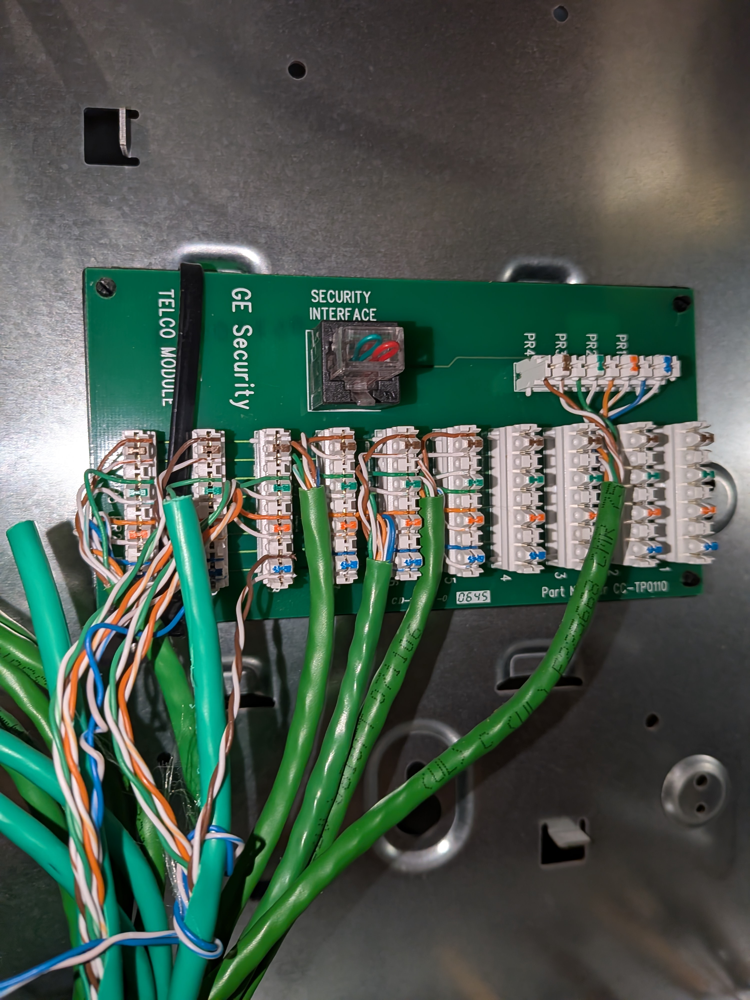
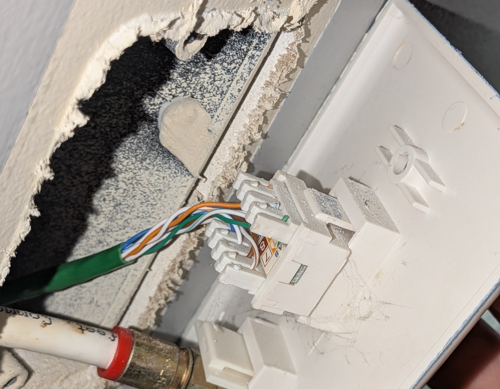

(This is my first proper blog post *ever*, so be aware it may be a bit rough around the edges.)

## The Background
My house, despite being built fairly recently in the late 2000's, does not have ANY Ethernet wiring whatsoever.

This has never really been a pain for me since I have found WiFi perfectly acceptable, until I decided to set up a home server.

I'll probably detail this more in a seperate blog post, but for now all you need to know is that my home server simply did not have WiFi support.
I remembered from my previous experience of using Raspberry Pi's just how annoying and unreliable WiFi can be for devices (like a server) that need a stable network connection.

Thankfully, I did have a WiFi extender, which came with an ethernet port for device connectivity, so there was atleast *some* connectivity for the meantime.
However, it's location was not exactly *ideal*, being out in the open where anyone could potentially just topple it one day (and damage it).

I didn't want to relocate the WiFi extender either, as the only suitable locations for the home server would also just be too far away from the "pain points" of the house where I needed the relayed WiFi.

## The Discovery

Thankfully, one day while bored in the basement I stumbled upon this:

Initially, I had *absolutely no idea* what this was or how it could possibly help me with my Ethernet problem.

However, upon googling, I discovered this was a *"telephone distribution box"*?

I grew up in an age of cellular phones, so I had *absolutely no experience* with these things whatsoever.
In short (afaik), they essentially act as a central hub for telephone lines in the house, allowing the distribution of phone signals to various rooms.

Now, I didn't really care so much about the board *itself*, but more so about the wiring connected to it.
This wiring, as apparent by the the various colored twisted pairs and the "CAT5E" labeling, is actually just standard Ethernet cabling.

I got really excited at this discovery, as oftentimes phone lines would use simpler, cheaper wiring that wouldn't support high-speed data transfer.
This meant that I could theoretically just use these cables for Ethernet instead of just being 
unused phone jacks!

## The Wiring
I am by no means an Electrician, I am very stupid in that regard.
However, thanks to Google, I was able to find that many others had already done something similar to my plan.

In short, I would essentially have to:
1. Remove and reterminate the basement side of the phone jacks for Ethernet use
2. Use a probe / scanner to find where exactly these jacks lead.
3. Terminate the other ends of the cables at the respective rooms for Ethernet use
4. Test the cables to ensure proper connectivity

Removing the basement wiring was trivial, as I just had to yank hard enough from the white punch block to free each individual wire in the CAT5E cables.

However, I had no idea how to attach an ethernet jack to the end of these cables.
I was pretty scared of trying to use a punch down tool, since I had no experience with it whatsoever.

Thankfully, it turns out that there are actually tool-less punch down Ethernet jacks available, which made the process much less intimidating for a beginner like me.
All I really had to do is just strip the wire ends and fit them right in the jack, which is easier than it sounds, but still very easy.

Then it came time to find where exactly these cables led.

Alot of people online were saying to get a good quality scanner, but i'm cheap so I bought one off Amazon for ~40$

And it worked surprisingly well for my needs. I was able to trace each cable from the basement to the respective rooms without much hassle.

Once I had identified where each cable led, I proceeded to just reterminate those cables at the respective rooms for Ethernet use, following the same tool-less punch down method as before.

Finally, I used the same probe/scanner to test each cable and ensure proper connectivity throughout the house.

However, I faced one major problem.

My router and modem were located in a part of the house with NO ETHERNET JACK!
This meant that I couldn't directly connect my router and modem to the newly wired Ethernet network, which was a bit of a setback.

However, there was a spare coax port available as my family switched to fiber internet. 
Thus, I realized I could use a MoCA adapter!

In short, a MoCA adapter allows you to run Ethernet over coaxial cables, with a *tiny* amount of added latency, but at a much higher price compared to repurposing phone lines.

A quick 50$ on Ebay, and I had an Ethernet link to the router!

## The Network

Now I had a bunch of unplugged Ethernet jacks just sitting in my basement.
The first thing I did was 3D print a nice [bracket](https://www.thingiverse.com/thing:1234567) to hold all of the jacks in place securely.

Then, I used a random gigabit switch to to connect all of these jacks together.

I could *finally* move my home server to the basement, free of anyone bumping into it! (aswell as high speed internet, obviously)

All seemed well!

## The Evil Ethernet Switch of Doom and Despair

After a couple days, I started to notice my home server dropping off from the network, until I turned the surge protector (connected to the Ethernet switch and home server) off and back on again.

This would fix the issue, until it would just happen again the **very next day**.

I tried quite literally everything I could as my uptime numbers began to tank, from swapping cables to using a different network card, but nothing changed!

After SEVERAL WEEKS of frustration, I finally discovered the root cause of the problem: the Ethernet switch itself was faulty.

After spending yet another $40 on a new Ethernet switch, my home server finally stayed connected without any further issues.