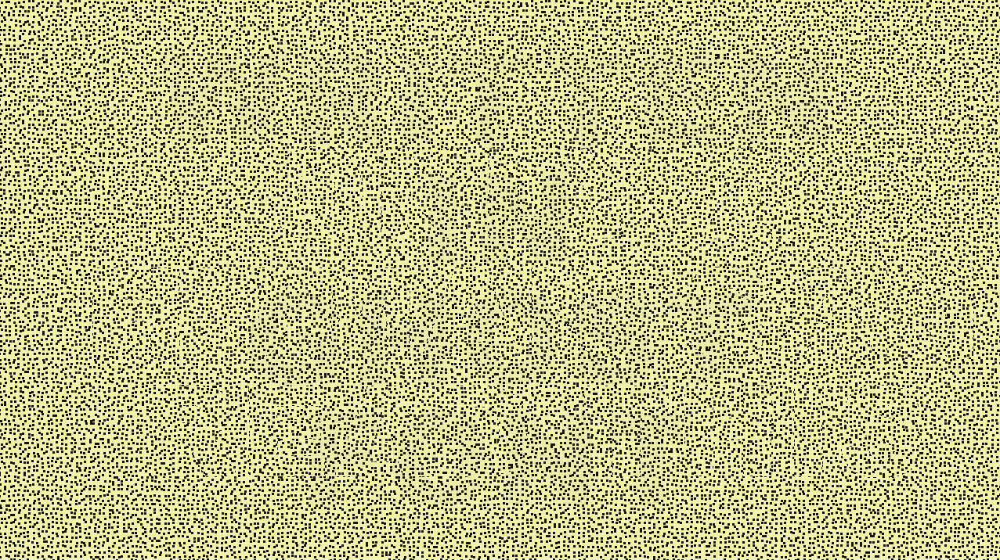
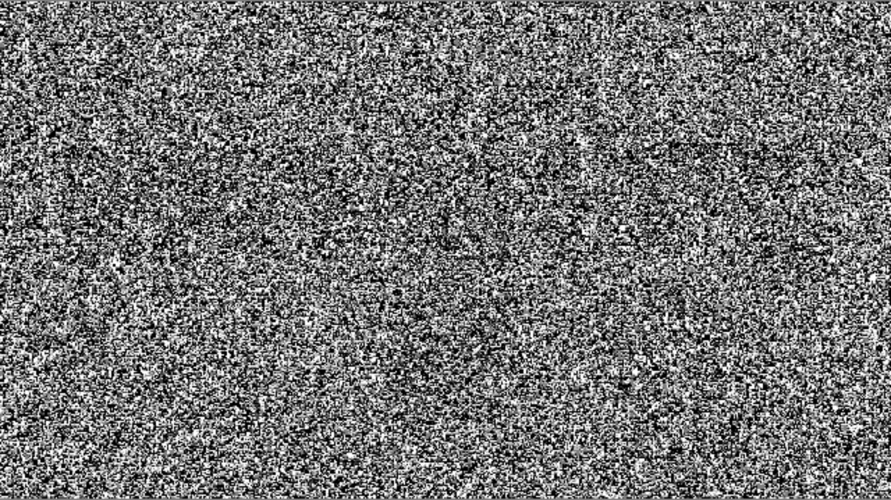
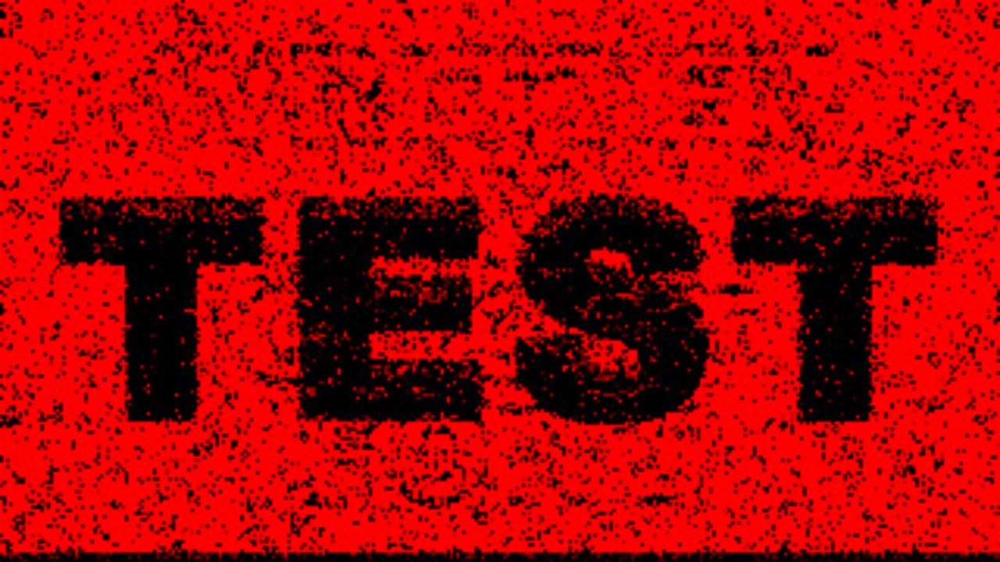
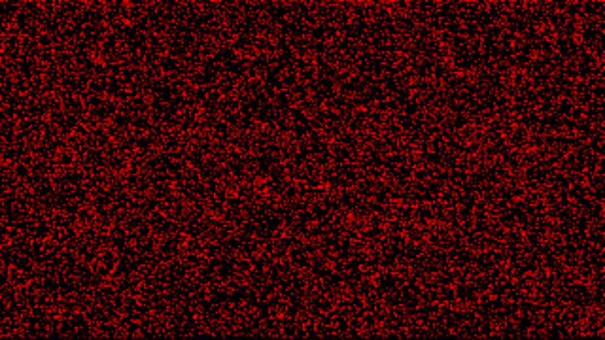
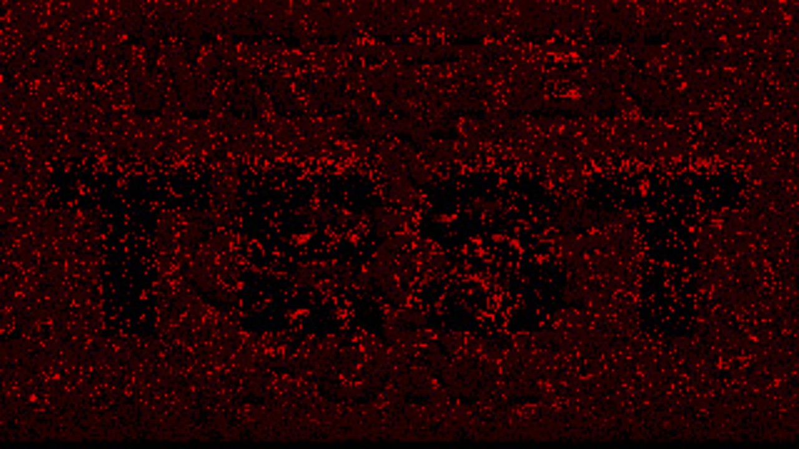
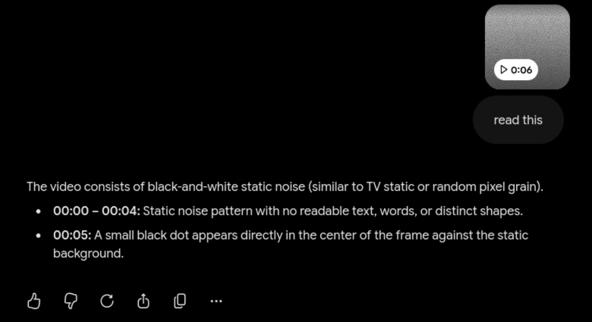

import GhostFontExample from "./ghostfont.gif";

*(please be aware,  I am by no means critiquing ghost font or anything, I just wanted to write a parser for it)*

## Background
You may have seen news articles and videos about a font that is "impossible" for AI to read.

Generally, these articles are referring to [Ghost Font](https://www.mixfont.com/ghost-font), a type of temporal-motion typography designed to be challenging for OCR systems to process.
In short it just means the font uses moving noise in opposing directions to make an image that only appears when it is played back.

Thus, traditional image-based OCR systems struggle to recognize the text as they have no *sense* of motion.

Here's an example:


It's a little bit difficult but you can still make out the text.

However, if given a single random frame from the animation, it just looks like noise :(


Now, to humans, the text is still readable because our brains can just "see" the motion.

However, for OCR / AI systems *(which afaik primarily rely on static images)*, the noise is impossible to discern.

## My Plan

I set out with one main goal, to create a parser that could decipher Ghost Font.

Now, I did have an additional goal tacked on to that, which was to make it fast.
I was really enjoying using C++ to write my own personal game, and it's also a very fast language (if you aren't shooting yourself in the foot), so I decided to use it for this project.

Best of all, I had **absolutely no experience**  with motion estimation or video processing. (great project idea)

## Extracting the frames


The first challenge was figuring out how to even extract the frames.
I *could* just wrap ffmpeg, but considering I needed speed, I wanted a faster approach.

This faster approach was to actually just use LibAV, the underlying library that ffmpeg is built on. 
Given that it's written in C, interfacing with it from my program was effortless.
Learning it was not so effortless, but after a few hours I succesfully had a working frame grabber!

I chose to wrap LibAV in my own simple C++ class since I really just needed a few consistent behaviors.
I really ended up liking this approach, as it was fun to use, and got me a lot more comfortable with C++ objects *(which are weird)*.

```cpp 
// example snippet to showcase my approach
const VideoFrames videoFrames(filename);

videoFrames.getNextFrame(); // hack bcz ghost font starts blank
const FrameData firstFrame = videoFrames.getNextFrame();
const FrameData secondFrame = videoFrames.getNextFrame();
```

However, this was just a tiny portion of what I needed to get done.

## Motion Estimation pt. 1

Motion estimation is a very complex topic with a lot of well proven techniques and algorithms.

However, because I'm going for speed *(my approach may actually be slower, have to benchmark)*, and writing this to learn, I decided to implement my own motion-estimation system from scratch.

I decided to simply loop over every pixel and check how similar it was to the surrounding pixels in the next frame.
The idea behind this was that moving noise would *have* to have moving pixels, so thus if I just tracked where each pixel was going I could get motion vectors.

```
ooo
oxo <-- pixel, compares similarity with neighboring pixels of the next frame
ooo
```

```cpp
// stub is a bit more complex because we have to deal with rgb
constexpr int channels = 3;
const int stride = firstFrame.width * channels;
for (int y = 1; y < firstFrame.height - 1; ++y) {
    for (int x = 1; x < firstFrame.width - 1; ++x) {
        for (int channel = 0; channel < channels; ++channel) {
            const auto i = static_cast<size_t>(y * stride + x * channels + channel);
            directionX[i] = static_cast<int16_t>(similarity(firstFrame.rgbPixels[i - channels], secondFrame.rgbPixels[i - channels]))
                - static_cast<int16_t>(similarity(firstFrame.rgbPixels[i + channels], secondFrame.rgbPixels[i + channels]));
            directionY[i] = static_cast<int16_t>(similarity(firstFrame.rgbPixels[i - stride], secondFrame.rgbPixels[i - stride]))
                - static_cast<int16_t>(similarity(firstFrame.rgbPixels[i + stride], secondFrame.rgbPixels[i + stride]));
        }
    }
}
```

I also decided to incorporate a nice optimization I had learned from my experience build a Conway's Game of Life clone, padding.


In this case it was not so much padding, as it was just ignoring the outer borders of the image *(since they were likely to not be significant at only 1px)*
This optimizes the code by removing the need for costly bounds checks, where I would have to run at minimum 8 comparisons per pixel.


Now, with the simple motion estimation in place, I decided to quickly just run it on a sample Ghost Font image and output the motion vectors.



Yikes, that does NOT look like the text I need for OCR to work.

The simple motion estimation approach is doing this due to it's limited pixel size.
Thus, any noise can trip up the motion estimation, leading to junk motion vectors.

## Motion Estimation pt. 2
At this point I considered just giving up, since I geniunely had no idea what other approach I could implement myself.

However, while at work an idea popped up into my head.

*if the motion estimation is failing due to the limited pixel size, maybe I need to consider larger blocks of pixels instead of individual ones?*

Thus, I started work on a new motion estimation approach that used "blocks" of pixels rather than individual ones.

In short, I essentially just compare the total "similarity score" of each block of pixels to it's adjacent neighbors, much like the pixel solution before but instead using blocks.
However, checking adjacent pixels was not enough range, as noise could still move farther than this one pixel limit.

Thus, I introduced a search-range parameter to set how far each block could search.
```cpp
inline int16_t bestVerticalShiftBlock(const uint8_t* first, const uint8_t* second, const int stride, const int blockSize, const int searchRadius) {
    int16_t bestDy = static_cast<int16_t>(-searchRadius);
    int bestDiff = stampDiffBlock(first, second, stride, -searchRadius, blockSize, std::numeric_limits<int>::max());

    for (int16_t dy = static_cast<int16_t>(-searchRadius + 1); dy <= searchRadius; ++dy) {
        const int diff = stampDiffBlock(first, second, stride, dy, blockSize, bestDiff);
        if (diff < bestDiff) {
            bestDiff = diff;
            bestDy = dy;
        }
    }

    return bestDy;
}
```

And, upon running various different combinations of block sizes and search radii, I was finally able to get an image!


## Dynamic Search Radius Adjustment

However, I now had a new problem.

Ghost Font lets users input varying noise speeds, which means that I would have to adjust the search radius dynamically.

This is due to the fact that having too low of a search radius proved to just output noise like this:

While having too high of a search radius introduced way too much noise and inaccuracies:

*you can also see the fake text designed to trip up LLM's which is pretty cool*

Therefore, I had to devise a way to perfectly adjust the search radius to an optimal value.

Now, while I can see what makes an image clear or noisy, I had no idea how to implement this within code.

I ended up settling on comparing the 90th and 10th percentiles of block similarity scores.
The block similarity score essentially just checks how similar a block is to it's neighbors.
As you can imagine, noise has very high variability while actual text tends to have much lower variability.

Thus, by comparing the 90th (low variability) and 10th (high variability) percentiles of block similarity scores, I could determine "how noisy" an output was programatically.

With this approach, I could then just abuse the fact that my code is somewhat fast to increment the search radii until it found the first peak in "non-noisyness".

```cpp
for (int searchRadius = 5; searchRadius < 20; ++searchRadius) {
        // specify blank filename so we dont emit image
        DirectionResult direction = runDirection(firstFrame,secondFrame,blockSize,searchRadius,"");
        
        double varianceValue = calculateDirectionYVarianceRatio(direction.directionY, direction.width, direction.height);
        
        if (varianceValue > 5) { // rough threshold, a bit messy but good for now
            std::println("Found good candidate!");
            // write output image
            writeDirectionPpm(outputFilename, direction.directionY, direction.width, direction.height, searchRadius);
            return;
        }
    }
```

This worked shockingly well, taking less than a second to find the optimal search radius!
```
$ time ./defeatghostfont -a testex.webm 

Opening: testex.webm
Variance for sr 5: 1.2668175681042013
Variance for sr 6: 1.24119058794357
Variance for sr 7: 1.2450304327673691
Variance for sr 8: 1.2831286918431009
Variance for sr 9: 1.2917653759232217
Variance for sr 10: 1.3233922855277158
Variance for sr 11: 2.0212594356659053
Variance for sr 12: 398.3973772283314
Found good candidate!


real    0m0.339s <---  fast!
user    0m0.303s
sys     0m0.050s
```

I did also find that using block sizes of 8 worked as a perfect middle ground between low noise and high detail.

Now that I have a reliable method to extract the text from Ghost Font, all that was left was OCR.

## OCR
Because I am no where near smart enough to implement my own OCR solution, I decided on just using a preexisting libary for that step.

The most popular OCR library by far is Tesseract. Due to it being written in C++, it also has excellent interop *(duh)* with C++ projects.

This made it trivial to add it to my project.

```cpp
tesseract::TessBaseAPI api;
//initialize the api
if (api.Init(nullptr, "eng") != 0) {
    throw std::runtime_error("Could not initialize Tesseract OCR");
}

//ghost font only uses these specific characters, so we can only include them to improve accuracy
api.SetVariable("tessedit_char_whitelist",
    "QWERTYUGIOPASDFHJKLZXCVBNM!&?,.'-1234567890 \n"
    );
api.SetPageSegMode(tesseract::PSM_SINGLE_BLOCK);
api.SetImage(pix.get());
//custom deleter class
std::unique_ptr<char[], TessTextDeleter> outText(api.GetUTF8Text());

api.End();

return {outText.get()};
```

I did also utilize one of it's dependencies, Leptonica, for a quick denoiser + resize pass before OCR for better accuracy.

*the original image*


*denoised + resized (resized doesn't really show on the blog since scaled up either way)*


It was a bit hard finding the perfect denoising amount, so I had to deal with the little "nibbles" in the characters, but it made OCR perform much better so I don't mind.

Running the final product provided great results for videos with less text.
```text
$ ./defeatghostfont testex.webm direction_y.ppm -a
Opening: testex.webm
Variance for sr 5: 1.2668175681042013
...
Variance for sr 12: 398.3973772283314
Found good candidate!
OCR RESULT: TEST
```

But it definitely struggled on videos with lots of text / non-alphanumeric characters.
```text
original string ---> "THIS IS A LONG MESSAGE!'PP.,.,.,.,.."

$ ./defeatghostfont harder.webm direction_y.ppm -a -b 10
Opening: harder.webm
Variance for sr 5: 1.2890841173215275
...
Variance for sr 15: 721.3278463648834
Found good candidate!
OCR RESULT: THIF 18 & LONG <--- yikes
MERSAGE VPF.,.
```

Feeding the OCR image to Gemini yielded a slightly better result, but it still mistook the characters for corrupted noise.


## Conclusion

While OCR isn't perfect and can especially struggle with noiser images, it is much faster and essentially free compared to utilizing AI.
*(although to be fair, the whole point of this project was enabling AI to read the font)*

I would **definitely** call it a success compared to feeding the raw video data to an AI however.



In the future, I could definitely improve the performance by making the program multithreaded, since right now it just hammers a single core.
I also could experiment with different denoising techniques to further improve OCR accuracy.

All in all however, this was a very fun passion project and I learned a lot along the way.

## Update - 8/13/26

Turns out multithreading was actually REALLY easy.

And by really easy, I mean the commit literally only added *2 lines* *(1 line if not counting build system changes)* of code to enable multithreading.
```cpp diff
#pragma omp parallel for schedule(dynamic) // <---- LITERALLY JUST THIS

    for (int blockY = 0; blockY < directionHeight; ++blockY) {
        const int y = paddedFirstFrame.yPad + blockY * blockSize;
        for (int blockX = 0; blockX < directionWidth; ++blockX) {
            ... //more code here
```
Just through testing on my 8-thread 9600x CPU, it easily pushes the bottleneck away from the actual pixel solving stage, towards the I/O and OCR.
*(will add flame graphs later)*

This was all possible through OpenMP, *(a high-level runtime?)* which essentially just allows me to put a macro to run loops in a thread pool.
I was already pretty familiar with thread pools from my work with Spring Boot and Java, so it didn't seem too "magical" to me.

Although, I may also look into instead using one thread per image / step size solver, rather than batching each block.
I will still have to benchmark and see if it's faster, but it could potentially offer even better parallelism and performance.

However it may also be worth seeing if I can optimize the I/O + OCR, since I really haven't looked into that.

Overall though, I am very happy with the performance improvements achieved through a tiny code change.